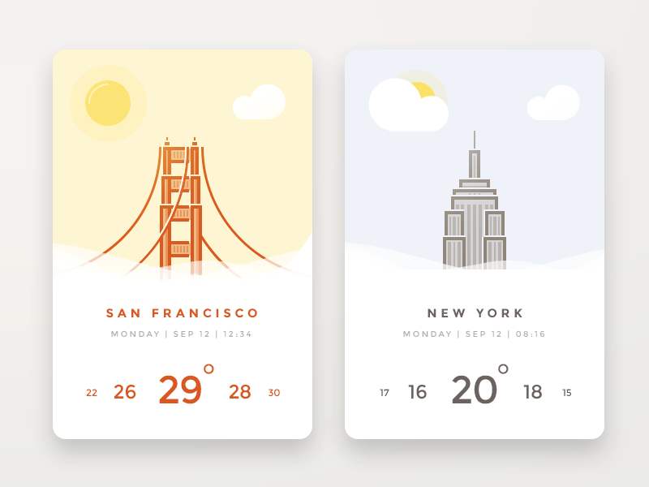
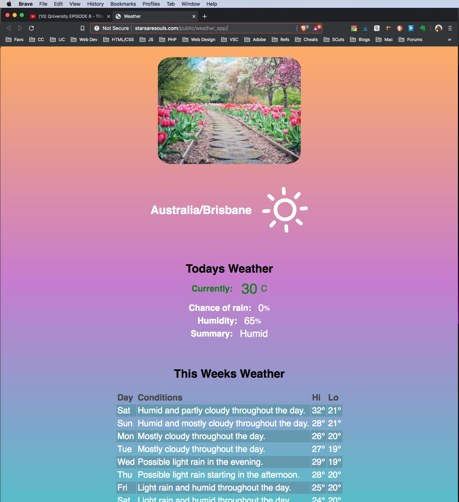
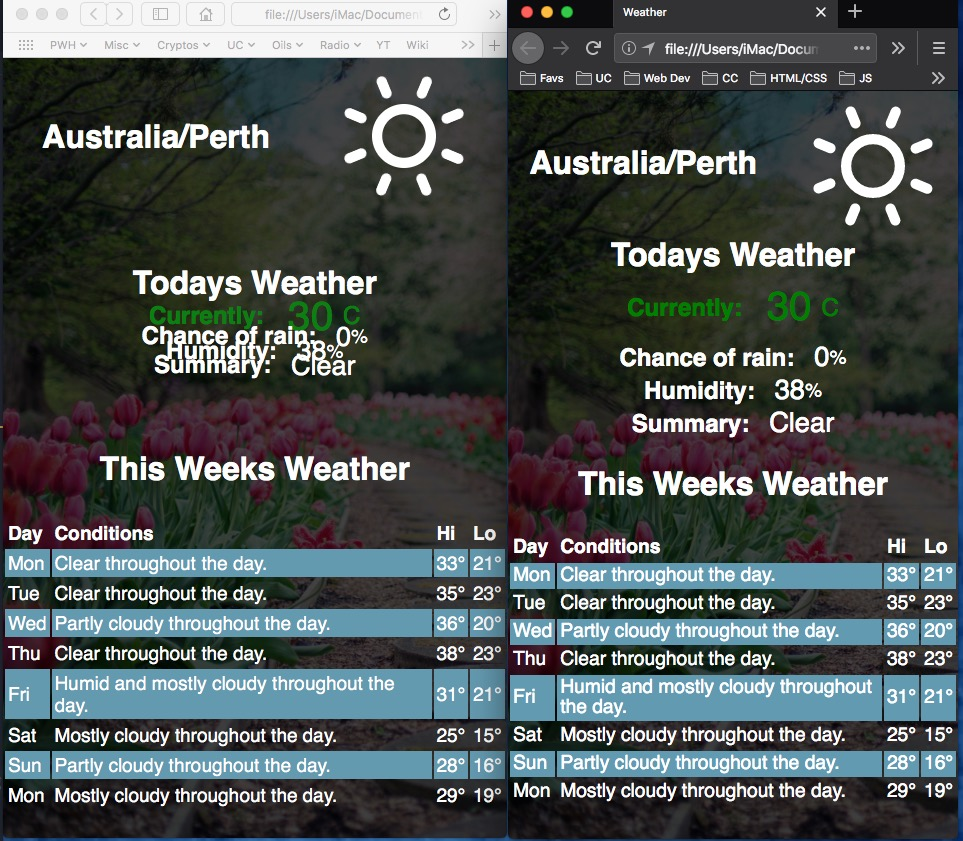

# <span style="color:lightblue">DarkSky Sketch App Design Rationale</span>

</br>

## <span style="color:orange">Link to web application below:<span>

[DarkSky Weather App](https://starsaresouls.com/public/weather_app/)

</br>

## <span style="color:lightblue">Concept</span>

The DarkSky weather app was concieved as a simple one page application displaying details of todays days weather and a day by day weekly forecast table displaying a weather summary and expected high/low temperatures for each day.

In addition the application displays a background image based on todays current weather details (temperature) using four seasonal images and color codes the current days temperature based on ranges varying from red (hot) to blue (cold). The seasonal image and current temperature color coding provicdes the user with immediate (approximate) visual feedback.

The application also displays an animated icon (Skycons - designed by The Dark Sky Company) to further visually represent the current days weather. The icon is generated by javaScript using the HTML canvas tag.

</br>

### **Examples of other weather apps**

A few examples of other weather apps for inspiration:

</br>



</br>


</br>

## <span style="color:lightblue">Developing the code<span>

The HTML and CSS were straightforward while the javascript / API code required more consideration and posed numerous challenges.

</br>

### **Vanilla vs jQuery**

The first consideration was whether to use vanilla javascript or the jQuery library. I decided on javascript for no other reason than furthering my javaScript skills without relying jQuery. This seemed appropriate due my beginner level skills in javascript.

</br>

### **Fetch vs Axios**

The next choice was fetch or axios. Fetch is capable of reproducing the key features of Axios and is readily avaialble in all modern browsers. One of the key features of Axios is backward compatibility (wide browser support - including old browsers like IE11). Fetch can achieve the same with poloyfills.

Some of the key benefits of Axios is the simplicity of setting response timeouts, automatic JSON data transformation and HTTP interceptors.

</br>

### **CORS**

In order to eliminate any CORS issue I elected to use a proxy server (herokuapp) as opposed to JSONP for simplicity factors. Both have issues (proxy server going down, some APIS don't allow JSONP, etc).

</br>

### **Background Image vs Image Div**

In the first iteration I used a background gradient (to represent the seasonal colours or rainbow) and added an image relevant to temperature (approximatley seasonal).

I changed this to using the (seasonal) image as the background and blending a background-color to enhance contrast by darkening.

</br>

Original is shown below:

</br>



</br>

## <span style="color:lightblue">Coding Challenges</span>

### **Skycons**

The documentation for Skycons was relatively simple to follow and implement. The one problem was that when you call the setIcons function (with the icon property from the DarkSky API and the HTOM DOM location of canvas element within the location div) from within the getWeather function the names do not match (not sure why it was done like this!).

In the DarkSky API resonse object - currently/icon - the icons are named in lower case using a hyphen seperator whereas in the Skycons API the icons are in uppercase with underscore seperators. This required currentIcon to be modified first using:

</br>

```javascript
const currentIcon = icon.replace(/-/g, '_').toUpperCase();
```

</br>

[Sky Icons](https://darkskyapp.github.io/skycons/) page here.

</br>

### **Refactoriing and Error handling**

In its original form the geolocation if statement contained everythng as shown below:

```javascript
const wDay = ['Sun', 'Mon', 'Tue', 'Wed', 'Thu', 'Fri', 'Sat'];

window.addEventListener('load', () => {
    let long;
    let lat;
    let temperatureDescription = document.querySelector('.temperature-description span');
    const temperatureDegree = document.querySelector('.temperature-degree');
    const locationTimezone = document.querySelector('.location-timezone');
    //   const temperatureSection = document.querySelector('.temperature');
    //   const temperatureSpan = document.querySelector('.temperature span');
    const humiditySpan = document.querySelector('.humidity span');
    const precipitationSpan = document.querySelector('.precipitation span');

    if (navigator.geolocation) {
        navigator.geolocation.getCurrentPosition(position => {
            console.log(position);
            long = position.coords.longitude;
            lat = position.coords.latitude;

            const proxy = 'https://cors-anywhere.herokuapp.com/';
            const api = `${proxy}https://api.darksky.net/forecast/4b4a48fa0948aa2966733db3181f88e7/${lat},${long}?units=si`;
            console.log(api);

            axios
                .get(api, {
                    timeout: 10000
                })
                .then(response => showOutput(response))
                .catch(err => console.log(err));

            function showOutput(response) {
                console.log(response);
                let weather = response.data;
                console.log(weather);
                const {
                    temperature,
                    precipProbability,
                    humidity,
                    summary,
                    icon
                } = weather.currently;
                console.log(temperature);

                // Set DOM Elements from the API
                temperatureDegree.textContent = temperature;
                precipitationSpan.textContent = precipProbability;
                humiditySpan.textContent = humidity;
                temperatureDescription.textContent = summary;
                locationTimezone.textContent = weather.timezone;

                // Change humidity to percentage
                const humidityPercentage = humidity * 100;
                humiditySpan.textContent = Math.floor(humidityPercentage);
                const preciptationPercentage = precipProbability * 100;
                precipitationSpan.textContent = Math.floor(preciptationPercentage);

                // Change temperature color based on range
                var element = document.getElementById('temp');
                var image = document.getElementById('image');
                if (temperature >= 35) {
                    element.classList.add('red');
                    image.classList.add('image-summer');
                } else if (temperature < 35 && temperature >= 28) {
                    element.classList.add('green');
                    image.classList.add('image-spring');
                } else if (temperature < 28 && temperature >= 15) {
                    element.classList.add('yellow');
                    image.classList.add('image-autum');
                } else if (temperature < 15) {
                    element.classList.add('blue');
                    image.classList.add('image-winter');
                } else {
                    element.classList.add('blueviolet');
                }

                // Set Icons
                setIcons(icon, document.querySelector('.icon'));

                // Render Weekly forecast table data
                document.getElementById('dailyForecast').innerHTML = renderWeeklyForecast(
                    weather.daily
                );
                console.log(weather.daily);

                function renderWeeklyForecast(fcData) {
                    let rowcount;
                    let resultsHTML =
                        '<tr><th>Day</th><th>Conditions</th><th>Hi</th><th>Lo</th></tr>';
                    rowcount = fcData.data.length;
                    if (rowcount > 8) {
                        rowcount = 8;
                    }
                    let i;
                    for (i = 0; i < rowcount; i++) {
                        let ts = new Date(fcData.data[i].time * 1000);

                        let dayTime = wDay[ts.getDay()];
                        let summary = fcData.data[i].summary;
                        let tempHigh = `${Math.round(fcData.data[i].temperatureHigh)}&deg`;
                        let tempLow = `${Math.round(fcData.data[i].temperatureLow)}&deg`;

                        resultsHTML += renderRow(dayTime, summary, tempHigh, tempLow);
                    }

                    return resultsHTML;
                }

                // Render weekly forecast table rows
                function renderRow(dayTime, summary, tempHigh, lowtemp) {
                    return `<tr><td>${dayTime}</td><td>${summary}</td><td>${tempHigh}</td><td>${lowtemp}</td></tr>`;
                }
            }
        });
    }

    function setIcons(icon, iconID) {
        const skycons = new Skycons({ color: 'white' });
        const currentIcon = icon.replace(/-/g, '_').toUpperCase();
        skycons.play();
        return skycons.set(iconID, Skycons[currentIcon]);
    }
});
```

Although the code function properly and rendered correctly, this decision was shortsighted in terms of code readability and efficiency as well as making adding the error handling and default location setting (in the event the user did not allow geolocation or other browser issues) problematic.

The code was refactored to seperate the geolocation code into a contained if statement (to which error handling could be added) and adding a new getWeather function containing the axios API code and the showOutput function to render the HTML.

### **Safari browser rendering anomolies**

Responsive rendering worked fine in Chrome and Firefox - for some reason not so in Safari. Not sure whether the issues relates to ems or flexbox or something else. Continuing to investigate this.


